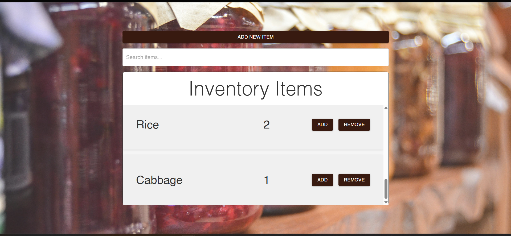
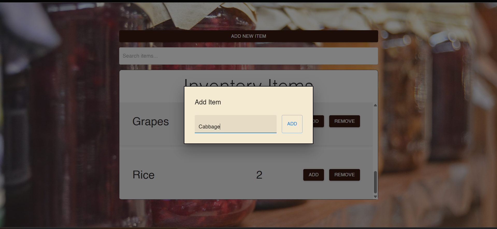
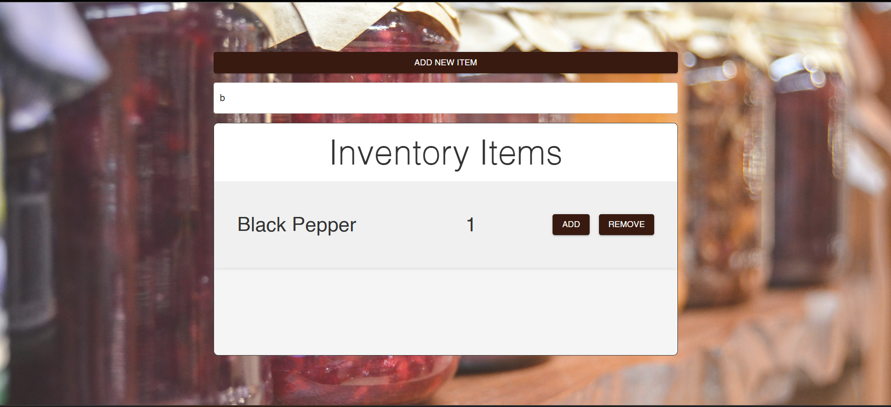

# Pantry Tracker

A pantry inventory tracker built with Next.js, React, and Firebase Firestore. I made this to manage item quantities, try out Firestore’s real-time updates, and learn how to integrate client state with a hosted database. It also includes a mock mode so it works without Firebase — useful for demos, testing, or just poking around without breaking anything.

---

## What It Does

- Add and remove pantry items
- Track quantities and update them in real time (or in mock state)
- Search your inventory
- Simple modal UI for adding new items
- Local filtering with `useState` and `useCallback`
- Firebase Firestore backend (with fallback if offline or read-only)

---

## Stack

This was built with:

- **Next.js 14** (App Router)
- **React 18**
- **Firebase Firestore** (NoSQL DB)
- **Material UI (MUI)** for the interface
- **Emotion** for styling (used by MUI under the hood)

---

## Why the Mock Mode Exists

I didn’t want anyone who forks this or views a demo to accidentally overwrite my data. So mock mode uses local state with hardcoded examples and lets you interact without touching the database. Great for GitHub demos or if Firebase is misconfigured.

You can turn it on in `.env.local`:

```env
NEXT_PUBLIC_USE_MOCK=true
````

---

## Screenshots

* Inventory UI
  

* Add Item Modal
  

* Search Item Modal
  
---

## Demo Video

[Watch the demo here](./public/pantry-demo.mp4)

This goes through adding/removing items, using mock mode, and the search/filter UI.

---

## How to Run It

```bash
git clone https://github.com/yourusername/pantry-tracker.git
cd pantry-tracker
npm install
cp .env.local.example .env.local
# Edit .env.local if using Firebase
npm run dev
```

---

## Firebase Setup (Optional)

To use Firebase instead of mock mode:

1. Create a Firebase project at [console.firebase.google.com](https://console.firebase.google.com)
2. Enable Firestore
3. Create a collection called `demo_pantry_items`
4. Add some sample documents
5. Copy your Firebase config into `.env.local`

Example rules for safe read-only access:

```js
rules_version = '2';
service cloud.firestore {
  match /databases/{database}/documents {
    match /demo_pantry_items/{document} {
      allow read: if true;
      allow write: if false;
    }
  }
}
```

---

## Notes on Styling & Layout

* MUI is used for components like modals, inputs, buttons, and layout
* Emotion is included by default (MUI’s styling engine)
* Hydration mismatches were fixed by wrapping the app in a custom ThemeProvider and Emotion cache provider
* If you see hydration warnings, they’re usually from browser extensions — test in Incognito or production build to verify

---

## License

MIT — use this however you want, just don’t deploy it as-is with unrestricted Firebase writes.

---

## Author

Built by Shalom Donga. I made this while exploring state management, Firestore, and deploying small full-stack projects with Next.js.
